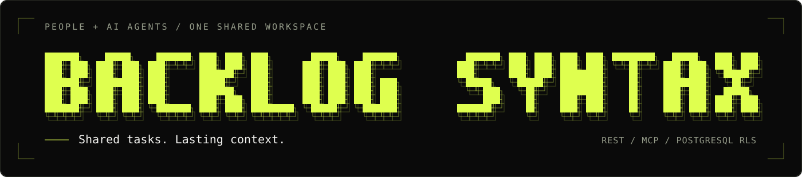
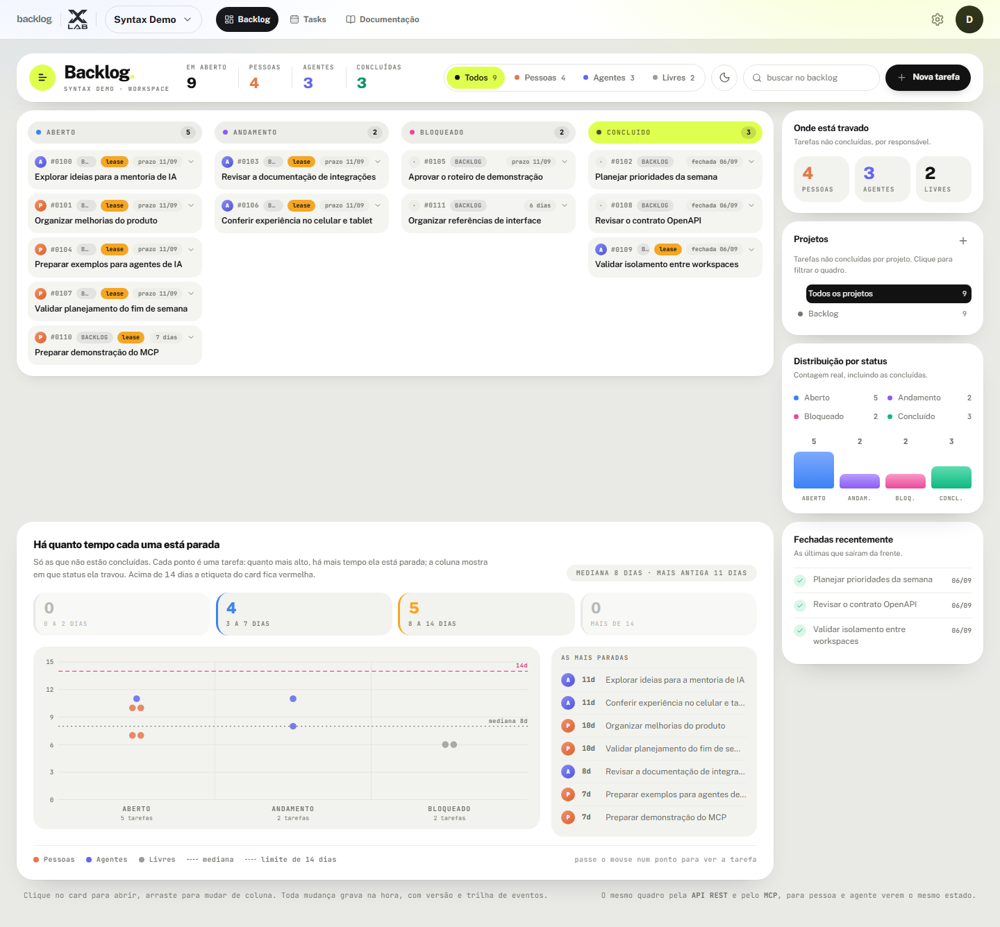
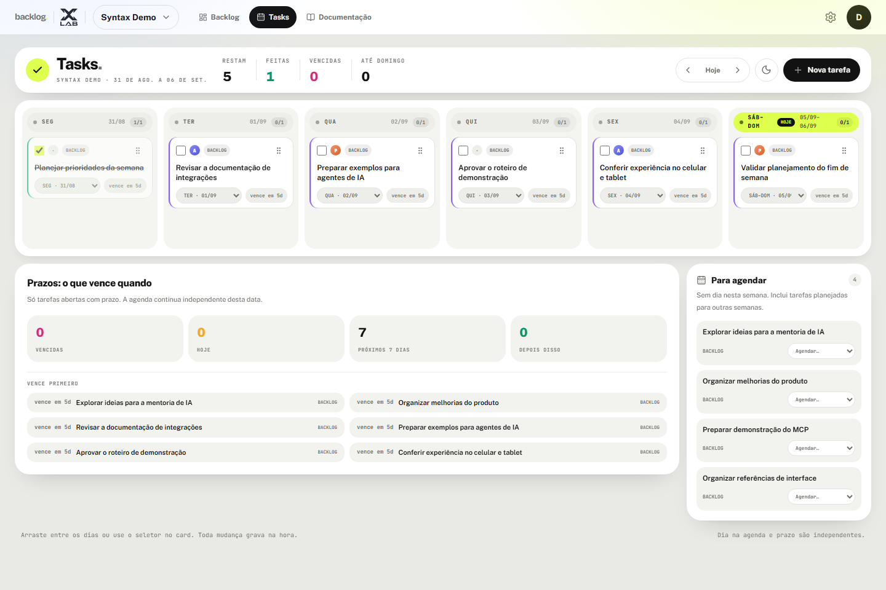

<p align="center">
  
</p>

<h1 align="center">Backlog Syntax</h1>

<p align="center"><strong>Tarefas compartilhadas entre pessoas e agentes de IA, com contexto que permanece.</strong></p>

<p align="center">
  <a href="https://backlog.syntaxlab.com.br">Site</a> ·
  <a href="https://backlog.syntaxlab.com.br/documentacao">Documentação</a> ·
  <a href="https://backlog.syntaxlab.com.br/entrar">Abrir o app</a> ·
  <a href="README.md">English</a>
</p>

<p align="center">
  <a href="https://github.com/thalesholleben/backlog-syntax-oss/actions/workflows/ci.yml"></a>
  <a href="LICENSE"></a>
  <a href="docs/runbooks/local-development.md"></a>
  <a href="docs/architecture/0003-database-roles-rls.md"></a>
</p>

Backlog Syntax trata o trabalho de agentes como um fluxo de domínio auditável. Pessoas e contas de serviço são principals distintos, claims expiram por lease, mutações usam concorrência otimista e o Row-Level Security do PostgreSQL é a última fronteira entre tenants.

## Estado do projeto

O site e o aplicativo estão disponíveis em **português do Brasil e inglês**, incluindo login,
onboarding, quadro, Tasks e configurações. Use o seletor PT/EN para alternar o idioma.
Detalhes em [idiomas, SEO e descoberta em Markdown](docs/features/internationalization.md).

A primeira V1 hospedada está disponível em [backlog.syntaxlab.com.br](https://backlog.syntaxlab.com.br), gratuita e sem SLA de disponibilidade. Inclui web autenticada, backlog, agenda semanal de tasks, REST/OpenAPI, MCP remoto e autosserviço de privacidade. Login Google e recuperação de senha por e-mail continuam desligados. Consulte o [runbook de deploy](docs/runbooks/domain-cutover.md) e a [página de transparência](https://backlog.syntaxlab.com.br/transparencia).

Este repositório contém o SaaS multi-tenant, não a skill de backlog/Tasks para uso
independente em um workspace. A licença MIT não concede acesso aos dados ou às credenciais
da versão hospedada. Consulte a [base da release](docs/README.md#release-baseline) para
distinguir a versão publicada do código que ainda aguarda PR.

## Como usar

- [Entrar no app](https://backlog.syntaxlab.com.br/entrar): uma sessão válida abre um workspace acessível sem pedir a senha novamente.
- **Backlog** organiza as tarefas por status, com filtros de projeto/responsável e histórico de atividade.
- **Tasks** agenda as mesmas tarefas em seis colunas semanais. Agendamento e prazo são independentes; itens sem dia continuam no backlog.
- [Guia de integração](https://backlog.syntaxlab.com.br/documentacao): documentação pública em boxed e versão contextual dentro do workspace.
- [Referência interativa da API](https://backlog-api.syntaxlab.com.br/docs) e [OpenAPI JSON](https://backlog-api.syntaxlab.com.br/openapi.json): contratos REST para clientes e agentes.
- MCP remoto usa `https://backlog-api.syntaxlab.com.br/mcp`. WebMCP é um recurso opcional do navegador, não um requisito para usar o app.

## Visão do produto

Capturas atualizadas em 6 de setembro de 2026. A landing mostra a hero publicada;
Backlog e Tasks mostram a interface atual com dados fictícios, sem registros de clientes.

### Landing page pública


### Quadro do workspace



### Agenda semanal Tasks



## Por que este projeto existe

Muitos quadros expõem cards para agentes, mas não modelam uma coordenação segura. Backlog Syntax nasce ao redor de claims explícitos, evidência, handoff, pedidos de decisão, override humano, idempotência e isolamento entre workspaces.

O público inicial são solo builders, pequenos times humano-agente e mentorados que precisam de uma implementação realista para estudar e hospedar.

## Arquitetura resumida

| Superfície | Tecnologia | Responsabilidade |
| --- | --- | --- |
| Web | Next.js App Router | Páginas públicas SSR e produto autenticado responsivo |
| API | Hono + OpenAPIHono | REST `/v1`, OpenAPI, autorização e casos de uso |
| API para agentes | MCP Streamable HTTP | Tools e resources escopados sobre os mesmos casos de uso |
| Dados | PostgreSQL 18 + Drizzle | Domínio, migrations, roles, grants e RLS |

O monorepo usa `pnpm`. Better Auth fica restrito a identidade, sessões, login social e provedor OAuth. A tenancy de workspaces pertence ao domínio do produto.

Leia as [decisões de arquitetura](docs/architecture/README.md) e o [modelo de segurança](docs/architecture/0003-database-roles-rls.md) antes de alterar uma fronteira de confiança.

## Desenvolvimento local

Pré-requisitos:

- Node.js 24
- pnpm 11.24
- Docker Desktop com Compose

```bash
cp .env.example .env
pnpm install --frozen-lockfile
docker compose up -d db
pnpm build:packages
```

Na raiz do repositório, inicie API e web em terminais separados, carregando o ambiente explicitamente:

```bash
# Terminal 1
node --env-file=.env --import tsx apps/api/src/server.ts

# Terminal 2
node --env-file=.env apps/web/node_modules/next/dist/bin/next dev apps/web
```

Não sobrescreva um `.env` existente. No desenvolvimento local, mantenha as duas origens
da API em `http://localhost:8787` e `WEB_ORIGIN` em `http://localhost:3000`. Para validar
canonicals locais, use a URL local da web em `PUBLIC_WEB_URL`. Consulte o [runbook local](docs/runbooks/local-development.md).

Rode `pnpm check` e `pnpm docker:test` depois de parar o processo local do Next.js. O gate de build
de produção grava em `.next` e recusa, de propósito, usar o mesmo diretório enquanto `next dev` ou
`next start` estiver ativo.

Por padrão, a web usa `http://localhost:3000` e a API usa `http://localhost:8787`. `pnpm docker:test` constrói imagens não-root, percorre um fluxo real no navegador e remove o banco descartável. Os valores de `.env.example` servem apenas para desenvolvimento local e precisam ser substituídos fora dele.

## Modelo de segurança

- `backlog_owner` executa migrations e nunca atende tráfego da aplicação.
- `backlog_auth` acessa somente dados de identidade e sessão.
- `backlog_app` é o role de domínio sem privilégio de contornar RLS.
- Tabelas do tenant exigem `workspace_id`, RLS forçada e chaves compostas pelo tenant.
- Em produção, cookies de navegador são seguros e host-only com prefixo `__Host-`. CORS usa allowlist exata.
- Credenciais de contas de serviço são ligadas a um workspace e a scopes. Agentes não escolhem outro tenant.
- Texto de tarefa é entrada não confiável e não concede escopo nem dispara fetch arbitrário.

Veja [SECURITY.md](SECURITY.md) para relato responsável. Não publique vulnerabilidades em issues.

## Mapa do repositório

```text
apps/web            Site público Next.js e interface autenticada do produto
apps/api            Adaptadores REST/OpenAPI e MCP em Hono
packages/contracts  Schemas, erros, tools e cenários compartilhados
packages/db         Drizzle, migrations, roles e testes de RLS
docs                Arquitetura, features, privacidade e operação
spikes              Experimentos executáveis para reduzir riscos
```

## Documentação

- [Índice da documentação e base da release](docs/README.md)
- [App autenticado, backlog e agenda Tasks](docs/features/app-web.md)
- [Site público, documentação e hero](docs/features/public-web.md)
- [Decisões de arquitetura](docs/architecture/README.md)
- [Escopo do produto](docs/features/product-scope.md)
- [Baseline LGPD](docs/privacy/README.md)
- [Runbook de desenvolvimento local](docs/runbooks/local-development.md)
- [Guia de contribuição](CONTRIBUTING.md)

## Configuração de domínio

Produção usa `https://backlog.syntaxlab.com.br` para a web e
`https://backlog-api.syntaxlab.com.br` para a API.
O PostgreSQL 18 é dedicado ao Backlog Syntax, sem compartilhar banco com outros produtos. A V1 não usa Redis.
`PUBLIC_WEB_URL` define URLs canônicas/sociais; `WEB_ORIGIN` define a origem permitida do navegador.
`PUBLIC_API_URL` e `NEXT_PUBLIC_API_URL` identificam a API dedicada. Alterar URLs públicas exige
rebuild da web. Mantenha esta API separada de serviços de outros projetos.

## Fluxo de contribuição

Toda próxima alteração, inclusive documentação, usa **branch separada e pull request para
`main`**. Não é permitido commit/push direto na `main`. Merge e deploy em produção precisam
de autorização explícita. Veja [CONTRIBUTING.md](CONTRIBUTING.md) e [AGENTS.md](AGENTS.md).

## Licença

[MIT](LICENSE) © 2026 Thales Gomes (`thalesholleben`).
